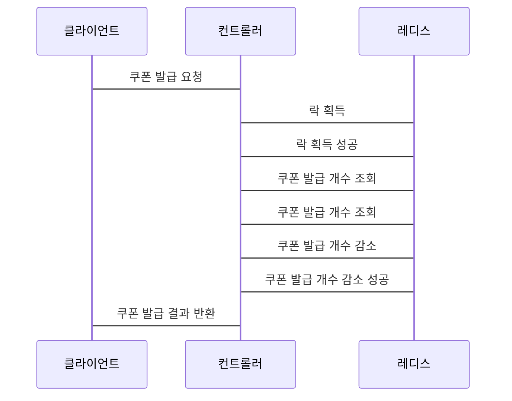

## **Redisson을 이용한 선착순 쿠폰 발급 시스템 (쿠폰 개수 정해진 경우)**

### Redisson 설정 파일을 작성

application.yml

```yaml
spring:
  redis:
    host: localhost
    port: 6379
    database: 0
    password:

redisson:
  config:
    cluster:
      nodes:
        - redis://localhost:6379
```

이 설정 파일은 다음과 같은 내용을 포함합니다.

- `spring.redis.host` 및 `spring.redis.port` 속성을 사용하여 레디스 서버의 호스트 이름과 포트를 지정합니다.
- `spring.redis.database` 속성을 사용하여 레디스 데이터베이스를 지정합니다.
- `redisson.config.cluster.nodes` 속성을 사용하여 레디스 클러스터의 노드 목록을 지정합니다.

### 쿠폰 발급을 처리하는 컨트롤러 클래스를 작성

```java
@RestController
@RequestMapping("/coupon")
public class CouponController {

    private final RedissonClient redisson;

    public CouponController(RedissonClient redisson) {
        this.redisson = redisson;
    }

    @PostMapping
    public ResponseEntity<Boolean> issueCoupon(@RequestParam String couponCode) {
        RLock lock = redisson.getLock("coupon-" + couponCode);
        lock.lock();

        try {
            RBucket<Long> remainingCountBucket = redisson.getBucket("remaining-count-" + couponCode);
            Long remainingCount = remainingCountBucket.get();
            if (remainingCount <= 0) {
                return ResponseEntity.ok(false);
            }

            remainingCountBucket.decrementAndGet();
            return ResponseEntity.ok(true);
        } finally {
            lock.unlock();
        }
    }
}
```

- 이 컨트롤러 클래스는 다음과 같이 동작합니다.

  - `lock()` 메서드를 사용하여 락을 획득합니다.
  - `remainingCountBucket.get()` 메서드를 사용하여 쿠폰이 남아 있는지 확인합니다.
  - 쿠폰이 남아 있지 않은 경우, `ResponseEntity.ok(false)`를 반환합니다.
  - 쿠폰이 남아 있는 경우, `remainingCountBucket.decrementAndGet()` 메서드를 사용하여 쿠폰 발급 개수를 감소시키고, `ResponseEntity.ok(true)`를 반환합니다.

  이렇게 구현하면 쿠폰 개수가 정해진 이벤트의 동시성 문제를 Redisson을 사용하여 효과적으로 해결할 수 있습니다.

### 컨트롤러 클래스를 테스트

```java
@SpringBootTest
class CouponControllerTest {

    @Autowired
    private CouponController couponController;

    @Test
    public void issueCoupon() throws InterruptedException {
        String couponCode = "1234567890";

        // 쿠폰 10개를 발급합니다.
        for (int i = 0; i < 10; i++) {
            Boolean isIssued = couponController.issueCoupon(couponCode);
            assertThat(isIssued).isTrue();
        }

        // 11번째 쿠폰을 발급 요청합니다.
        Boolean isIssued = couponController.issueCoupon(couponCode);
        assertThat(isIssued).isFalse();
    }
}
```

이 테스트 코드는 다음과 같이 동작합니다.

- `issueCoupon()` 메서드를 사용하여 쿠폰을 10개 발급합니다.
- 11번째 쿠폰을 발급 요청합니다.
- 쿠폰 개수가 10개로 제한되어 있기 때문에, 11번째 쿠폰은 발급되지 않습니다.

테스트 결과, 10개의 쿠폰은 모두 발급되고, 11번째 쿠폰은 발급되지 않는 것을 확인할 수 있습니다.

이렇게 구현하면 쿠폰 개수가 정해진 이벤트의 동시성 문제를 레디스슨을 사용하여 효과적으로 해결할 수 있습니다.





이 시퀀스 다이어그램은 다음과 같이 동작합니다.

1. 클라이언트는 컨트롤러에 쿠폰 발급 요청을 보냅니다.
2. 컨트롤러는 레디스에 락을 획득합니다.
3. 레디스는 컨트롤러에게 락 획득 성공을 알립니다.
4. 컨트롤러는 레디스에 쿠폰 발급 개수를 조회합니다.
5. 레디스는 컨트롤러에게 쿠폰 발급 개수를 알려줍니다.
6. 컨트롤러는 레디스에 쿠폰 발급 개수를 감소시킵니다.
7. 레디스는 컨트롤러에게 쿠폰 발급 개수 감소 성공을 알립니다.
8. 컨트롤러는 클라이언트에게 쿠폰 발급 결과를 반환합니다.
