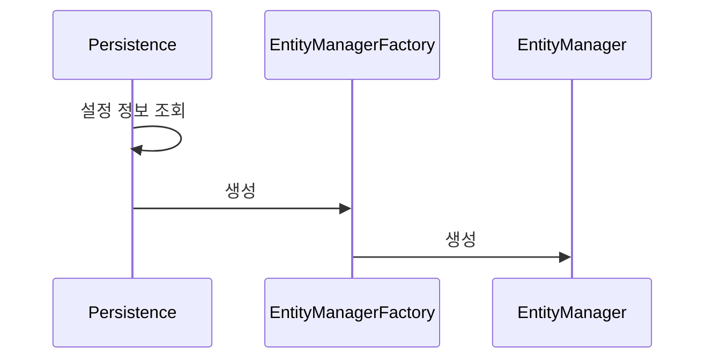

# JPA 실습1. JPA 설정

```groovy
plugins {
    id 'java'
}

group = 'jpa-basic'
version = '1.0.0'

repositories {
    mavenCentral()
}

dependencies {
    testImplementation platform('org.junit:junit-bom:5.9.1')
    testImplementation 'org.junit.jupiter:junit-jupiter'
    implementation 'org.hibernate:hibernate-entitymanager:5.6.3.Final'
    implementation 'com.h2database:h2:1.4.200'
}

test {
    useJUnitPlatform()
}
```


### Gradle 세팅


- H2디비는 gradle에서 implementation하는 드라이버 버전 호환성을 맞출 필요 있음


- javax.persistence-api는 jpa 인터페이스
- 구현체가 Hibernate

### 스프링 부트에서 JPA설정 및 스프링 부트을 쓰지 않는 단순 자바 프로젝트에서의 JPA 설정

- JPA를 사용한다면,  `persistence.xml` 파일이 필요할 수 있다.

- 이 파일은 JPA 엔티티 매니저를 설정하기 위한 설정 정보를 포함.

- Spring boot를 사용하는 경우

  - `persistence.xml` 파일이 필요하지 않다.
  - Spring boot는 자동 구성(auto-configuration)기능을 통해 JPA 설정을 자동으로 처리한다.
  - 대신 `application.properties` 또는 `application.yml` 파일에서 데이터베이스 및 JPA 관련 설정을 할 수 있다.

  ```yaml
  spring:
    datasource:
      url: jdbc:h2:tcp://localhost/~/test
      username: sa
      password: 
      driver-class-name: org.h2.Driver
    jpa:
      database-platform: org.hibernate.dialect.H2Dialect
      show-sql: true
      properties:
        hibernate:
          format_sql: true
          use_sql_comments: true
      # hibernate.hbm2ddl.auto 설정이 필요하다면 아래 줄의 주석을 해제하고 사용
      # hibernate:
      #   ddl-auto: create
  
  ```

  1. **`spring.datasource`**: 데이터 소스 설정을 담당
     - `url`: 데이터베이스 URL을 지정. 여기서는 `jdbc:h2:tcp://localhost/~/test`로, 로컬 호스트에서 실행 중인 H2 데이터베이스에 접근.
     - `username`: 데이터베이스 접속에 사용할 사용자 이름을 설정. 여기서는 `sa`
     - `password`: 데이터베이스 접속에 사용할 비밀번호를 설정. 비어 있는 문자열(`""`)이므로 비밀번호가 설정되어 있지 않음을 의미
     - `driver-class-name`: 사용할 JDBC 드라이버 클래스를 지정. H2 데이터베이스의 경우 `org.h2.Driver`를 사용
  2. **`spring.jpa`**: JPA 관련 설정을 담당.
     - `database-platform`: 사용할 데이터베이스 플랫폼의 Hibernate 방언을 지정.`org.hibernate.dialect.H2Dialect`는 H2 데이터베이스에 최적화된 SQL 구문을 생성.
     - `show-sql`: `true`로 설정되어 있으며, 이는 Hibernate가 실행하는 SQL 문을 콘솔에 출력하도록 함.
     - `properties.hibernate`: 추가적인 Hibernate 설정을 제공
       - `format_sql`: `true`로 설정하여 SQL 문이 보기 좋게 포맷되도록 함
       - `use_sql_comments`: `true`로 설정하여 SQL 실행 시 주석을 포함. 이는 개발 과정에서 디버깅에 도움을 줌

- Spring Boot를 사용하지 않는 경우

  - Java Gradle 프로젝트에서 JPA(Java Persistence API)를 사용할 경우, `persistence.xml` 파일의 필요성은 여전히 중요
  - /META-INF/persistence.xml 위치
  - **엔티티 매니저 팩토리 설정**: `persistence.xml` 파일은 엔티티 매니저 팩토리(Entity Manager Factory)를 설정하는 데 사용됨 이 파일은 데이터 소스, 캐시 설정, 쿼리 속성 등과 같은 중요한 JPA 설정을 포함
  - **엔티티 클래스 목록**: 프로젝트에서 사용하는 JPA 엔티티 클래스의 목록을 정의함. 이를 통해 JPA 구현체는 어떤 클래스가 데이터베이스 테이블과 매핑되는지 인식할 수 있음
  - **영속성 유닛(Persistence Unit) 정의**: `persistence.xml` 파일은 하나 이상의 영속성 유닛을 정의할 수 있음. 각 영속성 유닛은 특정 데이터베이스 연결 및 JPA 설정 집합에 대한 설정 정보를 포함.
  - **플러그인 가능한 공급자 설정**: 다양한 JPA 공급자(예: Hibernate, EclipseLink 등)와의 호환성을 위해 `persistence.xml` 파일을 사용할 수 있다.

  ```xml
  <?xml version="1.0" encoding="UTF-8"?>
  <persistence version="2.2"
               xmlns="http://xmlns.jcp.org/xml/ns/persistence" xmlns:xsi="http://www.w3.org/2001/XMLSchema-instance"
               xsi:schemaLocation="http://xmlns.jcp.org/xml/ns/persistence http://xmlns.jcp.org/xml/ns/persistence/persistence_2_2.xsd">
      <persistence-unit name="hello">
          <properties>
              <!-- 필수 속성 -->
              <property name="javax.persistence.jdbc.driver" value="org.h2.Driver"/>
              <property name="javax.persistence.jdbc.user" value="sa"/>
              <property name="javax.persistence.jdbc.password" value=""/>
              <property name="javax.persistence.jdbc.url" value="jdbc:h2:tcp://localhost/~/test"/>
              <property name="hibernate.dialect" value="org.hibernate.dialect.H2Dialect"/>
              <!-- 옵션 -->
              <property name="hibernate.show_sql" value="true"/>
              <property name="hibernate.format_sql" value="true"/>
              <property name="hibernate.use_sql_comments" value="true"/>
              <!--<property name="hibernate.hbm2ddl.auto" value="create" />-->
          </properties>
      </persistence-unit>
  </persistence>
  ```

  1. **JDBC 드라이버**: `org.h2.Driver`는 H2 데이터베이스에 접속하기 위한 JDBC 드라이버를 지정
  2. **사용자 이름 및 비밀번호**: 여기서는 사용자 이름(`sa`)과 비밀번호(`""`, 즉 비어 있는 문자열)를 설정
  3. **JDBC URL**: `jdbc:h2:tcp://localhost/~/test`는 네트워크를 통해 접근 가능한 H2 데이터베이스의 URL을 지정. 여기서 `~/test`는 사용자 홈 디렉토리에 있는 `test` 데이터베이스를 의미
  4. **Hibernate 방언**: `org.hibernate.dialect.H2Dialect`는 Hibernate가 H2 데이터베이스와 통신할 때 사용하는 SQL 방언을 지정
  5. **추가 Hibernate 설정**: `hibernate.show_sql`, `hibernate.format_sql`, `hibernate.use_sql_comments`는 SQL 로그 출력, SQL 포맷팅, SQL 주석 사용 등을 설정. 이들은 디버깅 및 개발 과정에서 유용




### **JPA(Java Persistence API)**의 **엔티티 매니저(Entity Manager)** 생성 과정을 도식화한 세 단계로 나눌 수 있다:

1. **설정 정보 조회**: 이 단계에서는 `META-INF/persistence.xml` 파일을 읽어서 JPA 설정 정보를 조회.이 설정 파일에는 데이터베이스 연결과 관련된 설정들이 포함
2. **`EntityManagerFactory` 생성**: 설정 정보를 바탕으로 `EntityManagerFactory` 인스턴스가 생성. 이 공장 클래스는 엔티티 매니저 인스턴스를 생성하는 역할.
3. **`EntityManager` 생성**: `EntityManagerFactory`를 사용하여 `EntityManager` 인스턴스들이 생성. 각 `EntityManager`는 엔티티에 대한 CRUD(Create, Read, Update, Delete) 작업을 수행하는 데 사용.
