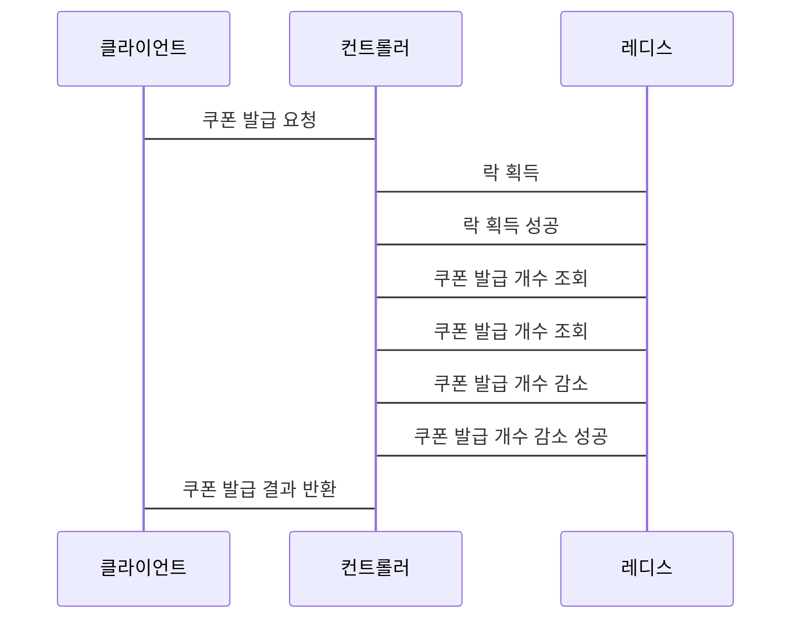

## **Redisson을 이용한 선착순 쿠폰 발급 시스템 (쿠폰 개수 정해진 경우)**

### Redisson 설정 파일을 작성

application.yml

```yaml
spring:
  redis:
    host: localhost
    port: 6379
    database: 0
    password:

redisson:
  config:
    cluster:
      nodes:
        - redis://localhost:6379
```

이 설정 파일은 다음과 같은 내용을 포함합니다.

- `spring.redis.host` 및 `spring.redis.port` 속성을 사용하여 레디스 서버의 호스트 이름과 포트를 지정합니다.
- `spring.redis.database` 속성을 사용하여 레디스 데이터베이스를 지정합니다.
- `redisson.config.cluster.nodes` 속성을 사용하여 레디스 클러스터의 노드 목록을 지정합니다.

```java
@Configuration
public class RedissonConfig {

    @Bean
    public RedissonClient redisson() {
        Config config = new Config();
        config.useSingleServer()
              .setAddress("redis://127.0.0.1:6379")
              .setPassword("password");

        return Redisson.create(config);
    }
}
```

이 클래스는 Redisson 클라이언트를 구성하고 스프링 빈으로 등록합니다.

- `@Configuration`: 이 어노테이션은 클래스가 애플리케이션 컨텍스트에 대한 빈 정의 소스임을 나타냅니다.
- redisson(): 이 메서드는 Redisson 클라이언트 인스턴스를 생성합니다.
  - `Config` 객체는 Redis 서버의 설정을 담고 있습니다. 여기서는 단일 서버 설정(`useSingleServer()`)을 사용합니다.
  - `setAddress`: Redis 서버의 주소를 설정합니다. 예제에서는 `localhost`에 있는 Redis 인스턴스를 가리킵니다.
  - `setPassword`: Redis 서버에 접근하기 위한 비밀번호를 설정합니다. 비밀번호가 필요 없는 경우 이 부분은 생략할 수 있습니다.
- `Redisson.create(config)`: 설정된 `Config` 객체를 사용하여 Redisson 클라이언트를 생성합니다.

### 쿠폰 발급을 처리하는 컨트롤러 클래스를 작성

```java
@RestController
@RequestMapping("/coupon")
public class CouponController {

    private final RedissonClient redisson;

    public CouponController(RedissonClient redisson) {
        this.redisson = redisson;
    }

    @PostMapping
    public ResponseEntity<String> issueCoupon(@RequestParam String couponCode) {
        RLock lock = redisson.getLock("coupon-" + couponCode);

        try {
            if (!lock.tryLock(10, 2, TimeUnit.SECONDS)) {
                return ResponseEntity.status(HttpStatus.CONFLICT).body("Lock acquisition failed");
            }

            RBucket<Long> remainingCountBucket = redisson.getBucket("remaining-count-" + couponCode);
            RTransaction transaction = redisson.createTransaction(TransactionOptions.defaults());
            Long remainingCount = transaction.getBucket(remainingCountBucket.getName()).get();

            if (remainingCount == null || remainingCount <= 0) {
                transaction.rollback();
                return ResponseEntity.status(HttpStatus.BAD_REQUEST).body("No coupons left");
            }

            transaction.getBucket(remainingCountBucket.getName()).decrementAndGet();
            transaction.commit();

            return ResponseEntity.ok("Coupon issued successfully");
        } catch (InterruptedException e) {
            Thread.currentThread().interrupt();
            return ResponseEntity.status(HttpStatus.INTERNAL_SERVER_ERROR).body("Operation interrupted");
        } catch (Exception e) {
            return ResponseEntity.status(HttpStatus.INTERNAL_SERVER_ERROR).body("Internal server error: " + e.getMessage());
        } finally {
            if (lock.isHeldByCurrentThread()) {
                lock.unlock();
            }
        }
    }
}

```

- ### 클래스 및 어노테이션

  - `@RestController`: 이 클래스가 RESTful 서비스를 제공하는 컨트롤러임을 나타내는 스프링 어노테이션입니다. 이를 통해 클래스의 메서드들이 HTTP 요청을 처리하고 JSON 형태의 응답을 반환할 수 있습니다.
  - `@RequestMapping("/coupon")`: 이 어노테이션은 컨트롤러의 모든 핸들러 메서드에 공통된 URL 경로 접두어를 설정합니다. 여기서는 "/coupon"으로 설정되어 있어, 컨트롤러 내의 모든 매핑은 "/coupon" 경로를 기반으로 합니다.
  
  ### 필드 및 생성자

  - `RedissonClient redisson`: Redisson 클라이언트 인스턴스를 참조하는 필드입니다. 이 클라이언트를 통해 Redis 작업을 수행합니다.
  - 생성자 `CouponController(RedissonClient redisson)`: 이 생성자는 Redisson 클라이언트 인스턴스를 주입받아 초기화합니다. 이는 의존성 주입(Dependency Injection)을 통해 이루어집니다.
  
  ### 메서드
  
  - `issueCoupon(@RequestParam String couponCode)`: 쿠폰 코드를 받아 쿠폰을 발급하는 역할을 하는 메서드입니다.
  - `@PostMapping`: 이 어노테이션은 HTTP POST 요청을 이 메서드로 매핑합니다.
  - `@RequestParam String couponCode`: HTTP 요청의 파라미터로부터 쿠폰 코드를 받아오는 어노테이션입니다.
  - `RLock lock = redisson.getLock("coupon-" + couponCode)`: 분산 잠금을 위한 Redisson의 락을 얻어옵니다. 쿠폰 코드별로 독립적인 락을 사용합니다.
  - `lock.tryLock(...)`: 분산 잠금을 시도합니다. 잠금에 성공하면 쿠폰 발급 로직을 수행합니다.
  - `RBucket<Long> remainingCountBucket = ...`: 쿠폰의 남은 수량을 저장하는 Redis 버킷을 가져옵니다.
  - `remainingCountBucket.decrementAndGet()`: 쿠폰 수량을 감소시킵니다.
  - `ResponseEntity`: HTTP 응답을 나타내는 객체로, 성공 또는 실패 상태와 메시지를 클라이언트에게 반환합니다.
  
  ### 예외 처리 및 분산 잠금
  
  - `try-catch-finally` 블록: 이 블록은 예외 처리를 적절히 관리합니다. 만약 Redis 작업 도중 예외가 발생하면, 응답으로 적절한 HTTP 상태 코드와 메시지를 반환합니다.
  - `finally`: 이 블록은 잠금을 해제합니다. 작업이 성공하든 실패하든, 항상 실행되어 잠금이 안전하게 해제됩니다.
  
  `CouponController`는 Redisson을 사용하여 분산 잠금을 관리하고, 쿠폰의 남은 수량을 관리하여 동시성 문제를 해결합니다. 이러한 설계는 여러 사용자가 동시에 같은 쿠폰 코드에 접근할 때 발생할 수 있는 데이터 무결성 문제를 방지합니다.

### 컨트롤러 클래스를 테스트

```java
import org.springframework.beans.factory.annotation.Autowired;
import org.springframework.boot.test.context.SpringBootTest;
import org.springframework.boot.test.mock.mockito.MockBean;
import org.springframework.http.ResponseEntity;
import org.redisson.api.RBucket;
import org.redisson.api.RLock;
import org.redisson.api.RedissonClient;
import org.junit.jupiter.api.BeforeEach;
import org.junit.jupiter.api.Test;
import static org.mockito.Mockito.*;
import static org.assertj.core.api.Assertions.assertThat;

@SpringBootTest
class CouponControllerTest {

    @Autowired
    private CouponController couponController;

    @MockBean
    private RedissonClient redissonClient;

    @MockBean
    private RLock lock;

    @MockBean
    private RBucket<Long> remainingCountBucket;

    @BeforeEach
    public void setup() {
        when(redissonClient.getLock(anyString())).thenReturn(lock);
        when(redissonClient.getBucket(anyString())).thenReturn(remainingCountBucket);
        when(lock.tryLock(anyLong(), anyLong(), any())).thenReturn(true);
    }

    @Test
    public void issueCoupon_LimitedToTenCoupons() throws Exception {
        String couponCode = "1234567890";

        // 처음 10개의 쿠폰 발급 요청이 성공적이어야 합니다.
        when(remainingCountBucket.get()).thenReturn(1L, 0L);
        for (int i = 0; i < 10; i++) {
            ResponseEntity<String> response = couponController.issueCoupon(couponCode);
            assertThat(response.getBody()).isEqualTo("Coupon issued successfully");
        }

        // 11번째 쿠폰 발급 요청이 실패해야 합니다.
        ResponseEntity<String> response = couponController.issueCoupon(couponCode);
        assertThat(response.getBody()).isEqualTo("No coupons left");
    }
}
```

- 이 테스트는 다음을 수행합니다:
  1. `@MockBean`을 사용하여 `RedissonClient`, `RLock`, 그리고 `RBucket`을 모의합니다. 이를 통해 실제 Redis 서버와의 상호작용 없이 `CouponController`를 테스트할 수 있습니다.
  2. `@BeforeEach`에서는 각 테스트 전에 필요한 설정을 초기화합니다. 특히, `lock.tryLock()`이 항상 `true`를 반환하도록 설정하여 잠금 획득이 성공하는 것으로 가정합니다.
  3. `issueCoupon_LimitedToTenCoupons` 테스트는 처음 10번의 쿠폰 발급이 성공하고, 11번째 요청에서 실패하는 것을 검증합니다. `when(remainingCountBucket.get()).thenReturn(1L, 0L);` 구문은 처음 10번의 요청에 대해 쿠폰이 남아있음을, 11번째 요청에 대해서는 쿠폰이 없음을 나타냅니다.

테스트 결과, 10개의 쿠폰은 모두 발급되고, 11번째 쿠폰은 발급되지 않는 것을 확인할 수 있습니다.

이렇게 구현하면 쿠폰 개수가 정해진 이벤트의 동시성 문제를 레디스슨을 사용하여 효과적으로 해결할 수 있습니다.





이 시퀀스 다이어그램은 다음과 같이 동작합니다.

1. 클라이언트는 컨트롤러에 쿠폰 발급 요청을 보냅니다.
2. 컨트롤러는 레디스에 락을 획득합니다.
3. 레디스는 컨트롤러에게 락 획득 성공을 알립니다.
4. 컨트롤러는 레디스에 쿠폰 발급 개수를 조회합니다.
5. 레디스는 컨트롤러에게 쿠폰 발급 개수를 알려줍니다.
6. 컨트롤러는 레디스에 쿠폰 발급 개수를 감소시킵니다.
7. 레디스는 컨트롤러에게 쿠폰 발급 개수 감소 성공을 알립니다.
8. 컨트롤러는 클라이언트에게 쿠폰 발급 결과를 반환합니다.
